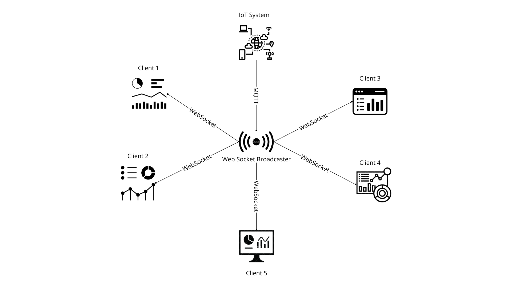

# PHP IoT Server

## What's it?

Receive data from IoT devices and send to WebSocket clients in real-time!

## O que é?

Receba dados de dispositivos IoT e entregue-os a clientes WebSocket em tempo real!

## Join Our Project and Contribute to Our PHP IoT Broker!

Our project offers:

MQTT Data Reception: Receive messages from IoT devices using MQTT (Message Queuing Telemetry Transport), a lightweight communication protocol for efficient message exchange.

Data Processing and Conversion: Process and convert MQTT messages to suit your needs.

Broadcast via WebSocket: Transmit messages or processed data to a WebSocket server for real-time updates.

Connection Management: Manage WebSocket connections to ensure messages from IoT devices are correctly distributed to all connected clients.

Real-Time Updates: Provide real-time updates to clients as MQTT messages are processed.

Summary: The PHP IoT Broker integrates IoT devices with a real-time WebSocket-based communication system, rapidly disseminating device information to connected clients.


## Participe do Nosso Projeto e Contribua com o Nosso PHP IoT Broker!

Nosso projeto oferece:

Recepção de Dados MQTT: Receba mensagens de dispositivos IoT usando MQTT (Message Queuing Telemetry Transport), um protocolo leve de comunicação para troca eficiente de mensagens.

Processamento e Conversão de Dados: Processe e converta mensagens MQTT conforme necessário.

Broadcast via WebSocket: Transmita mensagens ou dados processados para um servidor WebSocket para atualizações em tempo real.

Gerenciamento de Conexões: Gerencie conexões WebSocket para garantir que as mensagens dos dispositivos IoT sejam distribuídas corretamente para todos os clientes conectados.

Atualizações em Tempo Real: Forneça atualizações em tempo real para os clientes à medida que as mensagens MQTT são processadas.

Resumo: O PHP IoT Broker integra dispositivos IoT com um sistema de comunicação em tempo real baseado em WebSocket, disseminando rapidamente as informações dos dispositivos para os clientes conectados.

Envolva-se e ajude a melhorar este projeto empolgante!



# Use Case

- Feature: Realtime Dashboard for IoT Systems

  Scenario: Display real-time data on the dashboard
    Given the IoT system is connected and sending data
    And the dashboard application is running
    When the dashboard receives new data from the MQTT broker
    Then the dashboard should update the displayed data in real-time


# Environment

## Requirements

## MQTT Broker

### What is?

The MQTT Server is a Data Provider for PHP IoT Broker.

You can use - [Mosquitto](https://mosquitto.org/download/) as a MQTT Server! Is a lightweight solution.

### O que é?

O Servidor MQTT é um Provedor de Dados para o Broker IoT PHP.

Você pode usar o [mosquitto](https://mosquitto.org/download/) como um Servidor MQTT! É uma solução leve.

## Variables

In `.env` file:

```
MQTT_HOST=localhost
MQTT_PORT=1883

WEB_SOCKET_HOST=localhost
WEB_SOCKET_PORT=8081
```

# IoT Clients

## Whats is a IoT Client?

Here are some practical examples of IoT (Internet of Things) clients:

Temperature and Humidity Sensors: Devices that measure temperature and humidity in environments, such as sensors in a smart home system to control heating and ventilation.

Security Cameras: Cameras connected to the internet that stream images and videos in real-time to monitoring systems or mobile apps.

Smart Lighting Control Devices: Smart bulbs and switches that can be controlled remotely via mobile apps or voice commands.

Smart Thermostats: Devices that regulate the temperature of a home or office and can be programmed and controlled remotely.

Smart Energy Meters: Meters that monitor energy consumption in real-time and send data to utility companies for analysis and billing.

Motion Sensors: Devices that detect movement in a specific area and can trigger alarms or other automatic responses.

Vehicle Tracking Devices: GPS systems installed in vehicles that send data about the vehicle’s location and performance to monitoring platforms.

Connected Health Devices: Equipment such as blood pressure monitors and glucose meters that transmit health data to mobile apps or healthcare systems.

Irrigation Automation: Automated irrigation systems that adjust the amount of water based on soil moisture sensors and weather forecasts.

Smart Agriculture Equipment: Sensors and devices on farms that monitor soil conditions, climate, and plant health to optimize agricultural production.

These IoT clients send data to servers or cloud platforms and can receive commands or updates, enabling a wide range of applications in automation, monitoring, and control.

## O que é um cliente IoT?

Aqui estão alguns exemplos práticos de clientes IoT (Internet das Coisas):

Sensores de Temperatura e Umidade: Dispositivos que medem a temperatura e a umidade em ambientes, como sensores em um sistema de automação residencial para controlar o aquecimento e a ventilação.

Câmeras de Segurança: Câmeras conectadas à internet que transmitem imagens e vídeos em tempo real para sistemas de monitoramento ou aplicativos móveis.

Dispositivos de Controle de Iluminação: Lâmpadas inteligentes e interruptores que podem ser controlados remotamente via aplicativos móveis ou comandos de voz.

Termostatos Inteligentes: Dispositivos que regulam a temperatura de uma casa ou escritório e podem ser programados e controlados remotamente.

Contadores Inteligentes de Energia: Medidores que monitoram o consumo de energia em tempo real e enviam dados para empresas de energia para análise e faturamento.

Sensores de Movimento: Dispositivos que detectam movimentos em uma área específica e podem acionar alarmes ou outras respostas automáticas.

Dispositivos de Rastreamento de Veículos: Sistemas GPS instalados em veículos que enviam dados sobre a localização e o desempenho do veículo para plataformas de monitoramento.

Dispositivos de Saúde Conectados: Equipamentos como monitores de pressão arterial e glicemia que transmitem dados de saúde para aplicativos móveis ou sistemas de saúde.

Automação de Irrigação: Sistemas de irrigação automatizados que ajustam a quantidade de água com base em sensores de umidade do solo e previsões do tempo.

Equipamentos de Agricultura Inteligente: Sensores e dispositivos em fazendas que monitoram condições do solo, clima e saúde das plantas para otimizar a produção agrícola.


Sensores de Temperatura e Umidade: Dispositivos que medem a temperatura e a umidade em ambientes, como sensores em um sistema de automação residencial para controlar o aquecimento e a ventilação.

Câmeras de Segurança: Câmeras conectadas à internet que transmitem imagens e vídeos em tempo real para sistemas de monitoramento ou aplicativos móveis.

Dispositivos de Controle de Iluminação: Lâmpadas inteligentes e interruptores que podem ser controlados remotamente via aplicativos móveis ou comandos de voz.

Termostatos Inteligentes: Dispositivos que regulam a temperatura de uma casa ou escritório e podem ser programados e controlados remotamente.

Contadores Inteligentes de Energia: Medidores que monitoram o consumo de energia em tempo real e enviam dados para empresas de energia para análise e faturamento.

Sensores de Movimento: Dispositivos que detectam movimentos em uma área específica e podem acionar alarmes ou outras respostas automáticas.

Dispositivos de Rastreamento de Veículos: Sistemas GPS instalados em veículos que enviam dados sobre a localização e o desempenho do veículo para plataformas de monitoramento.

Dispositivos de Saúde Conectados: Equipamentos como monitores de pressão arterial e glicemia que transmitem dados de saúde para aplicativos móveis ou sistemas de saúde.

Automação de Irrigação: Sistemas de irrigação automatizados que ajustam a quantidade de água com base em sensores de umidade do solo e previsões do tempo.

Equipamentos de Agricultura Inteligente: Sensores e dispositivos em fazendas que monitoram condições do solo, clima e saúde das plantas para otimizar a produção agrícola.

## Up MQTT Broker

- Receive MQTT data from a IoT Devices

```bash
sudo systemctl start mosquitto
```

## Up WebSocket Server

Broadcast IoT MQTT messages to WebSocket Clients in real-time!

```php
./php web-socket-server.php
```

## Up IoT MQTT Router

- Subscribe topics from MQTT Server
- Redirect MQTT Data to WebSocket Server

```php
$ ./php iot-mqtt-router.php
```

## Exceptions Throwable

- Unreachable Web Socket Server -> Up MQTT Server

## Knowable troubleshoots

Enshure that port 8081 is free

- Know

```bash
sudo kill $(lsof -i :8081 | awk 'NR>1 {print $2}')
```
